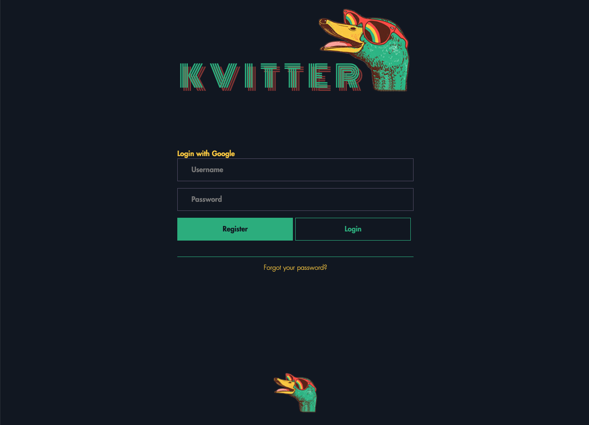
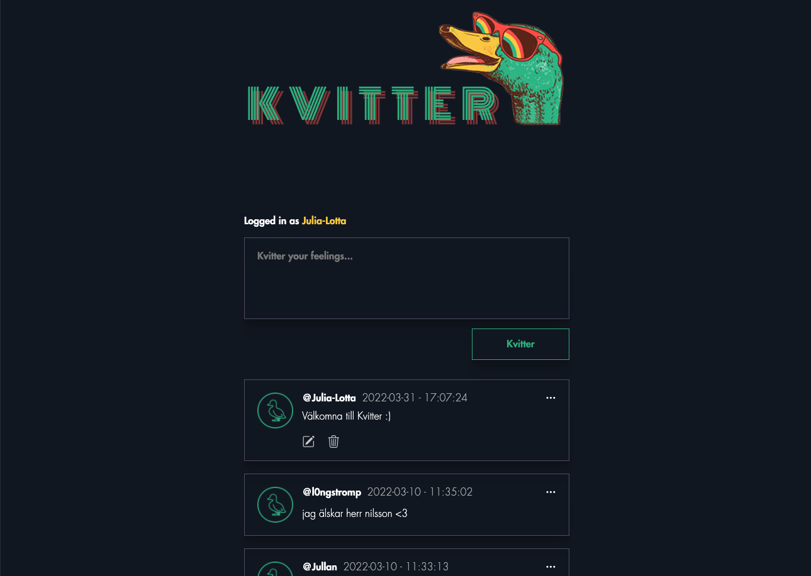
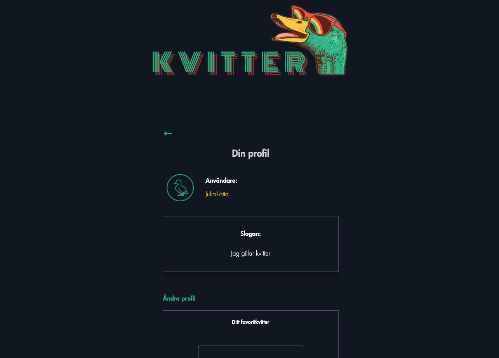

# MI-DynamiskWebbutveckling-Kvitter
A simplified Twitter-clone called Kvitter! Group assignment in Dynamic Web Development class att Medieinstitutet.

  

## Installation
1. Clone the repo\
`git clone https://github.com/julialotta//MI-DynamiskWebbutveckling-Kvitter`

2. Install npm packages\
`npm install`

3. Create a .env\
To run this application you need the following things in a .env file:\
`CONNECTION_STRING="[Your mongoDB connectionstring]`
`JWTSECRET=""`
`GOOGLE_CLIENT_ID="[Your Google Client ID]"`
`GOOGLE_CLIENT_SECRET=""`

4. Run Nodemon\
`nodemon`

4. Run Sass\
`npm run sass`

Visit localhost:8000 to view the project

## Built with
- HTML & SASS
- JavaScript
- Node.js
- Mongoose
- MongoDB
- Express.js
- Handlebars
- Bcrypt
- Cookie-parser
- dotenv
- Jsonwebtoken
- Passport

## Contributors
[Julia-Lotta Tinglöf](https://github.com/julialotta)  
[Rasmus Palm](https://github.com/michael-cwm)  
[Michael Miikkulainen](https://github.com/michael-cwm)
